# scRNA-seq Analysis Workflow: QC, Integration, Clustering, Marker Detection, and Cell Type Annotation

This repository demonstrates a reproducible single-cell RNA-seq analysis workflow using public 10x Genomics-style data from metastatic breast cancer ascites samples. The workflow uses **Seurat** for preprocessing, quality control, dimensionality reduction, integration, clustering, and marker gene detection. **SingleR** is used for automated cell type annotation.

The goal of this project is to demonstrate practical scRNA-seq analysis skills in a clean, portfolio-ready format.

---

## Dataset

This tutorial uses publicly available single-cell RNA-seq data from:

**Luo L., Yang P., Mastoraki S., et al.**  
*Single-cell RNA sequencing identifies molecular biomarkers predicting late progression to CDK4/6 inhibition in patients with HR+/HER2- metastatic breast cancer.*  
*Molecular Cancer*, 2025.  
PMID: **39955556** | PMCID: **PMC11829392** | DOI: **10.1186/s12943-025-02226-9**

GEO accession: **GSE262288**

Samples used:

- **GSM8162620** — Patient 3 ascites scRNA-seq sample 1
- **GSM8162621** — Patient 3 ascites scRNA-seq sample 2

For this workflow demonstration, these two samples are treated as replicate 10x Genomics-style scRNA-seq inputs. This repository does **not** attempt to reproduce the full biological conclusions of the original publication. Instead, it uses selected public samples to demonstrate a reproducible single-cell RNA-seq analysis workflow.

---

## Workflow Overview

The analysis includes:

1. Loading 10x Genomics count matrices
2. Creating Seurat objects for each sample
3. Calculating quality-control metrics
4. Filtering low-quality cells
5. Merging samples
6. Normalization and variable feature selection
7. Scaling and PCA
8. UMAP visualization before integration
9. Harmony integration
10. CCA integration comparison
11. Harmony-based clustering
12. Cluster marker gene detection
13. Feature plots and marker heatmap visualization
14. SingleR-based cell type annotation
15. Export of figures, marker tables, annotation tables, Seurat objects, and session information

---

## Repository Structure

```text
scRNAseq_analysis/
├── README.md
├── scripts/
│   └── run_scrna_analysis.R
├── results/
│   ├── figures/
│   │   ├── qc/
│   │   ├── dimensionality_reduction/
│   │   ├── integration/
│   │   ├── markers/
│   │   └── annotation/
│   ├── tables/
│   │   ├── markers/
│   │   └── annotation/
│   └── logs/
└── .gitignore
```

---

## How to Run

From the repository root:

```bash
Rscript scripts/run_scrna_analysis.R
```

The script expects the input directories to be:

```text
sample/sample_1/
sample/sample_2/
```

Each sample directory should contain the 10x Genomics matrix files, for example:

```text
barcodes.tsv.gz
features.tsv.gz
matrix.mtx.gz
```
---

## Key Outputs

The workflow generates organized output directories:

```text
results/figures/qc/
results/figures/dimensionality_reduction/
results/figures/integration/
results/figures/markers/
results/figures/annotation/
results/tables/markers/
results/tables/annotation/
results/objects/
results/logs/sessionInfo.txt
```

Important output files include:

```text
results/tables/qc_summary_by_sample.csv
results/tables/markers/all_cluster_markers.csv
results/tables/markers/upregulated_markers_by_cluster.csv
results/tables/markers/downregulated_markers_by_cluster.csv
results/tables/markers/top10_upregulated_markers_by_cluster.csv
results/tables/annotation/singler_cell_annotations.csv
results/tables/annotation/singler_celltype_counts.csv
results/objects/merged_harmony_singler_seurat_object.rds
results/logs/sessionInfo.txt
```

---

## Quality Control

Per-sample quality control was performed using the number of detected genes, total RNA counts, and mitochondrial transcript percentage. Cells were filtered using the following thresholds:

```text
nFeature_RNA > 200
nFeature_RNA < 6500
percent.mt < 15
```

### Sample 1 QC

Before filtering:

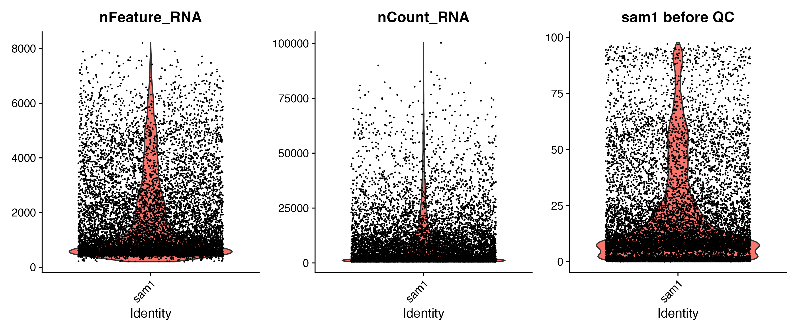

After filtering:

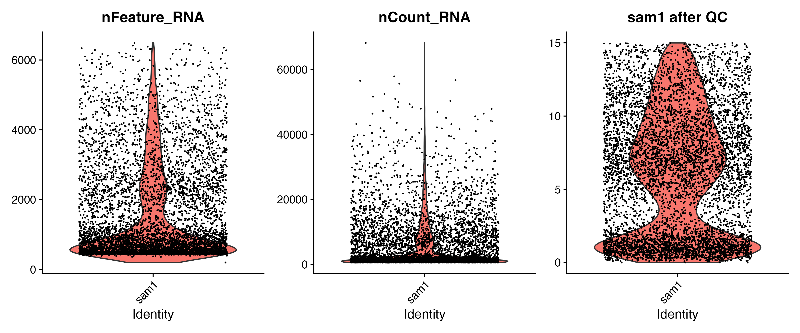

### Sample 2 QC

Before filtering:

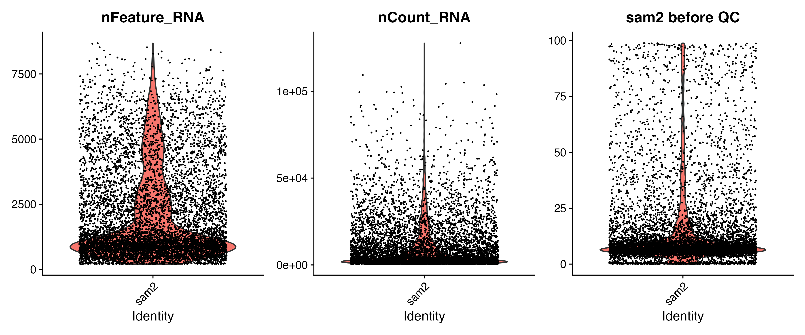

After filtering:

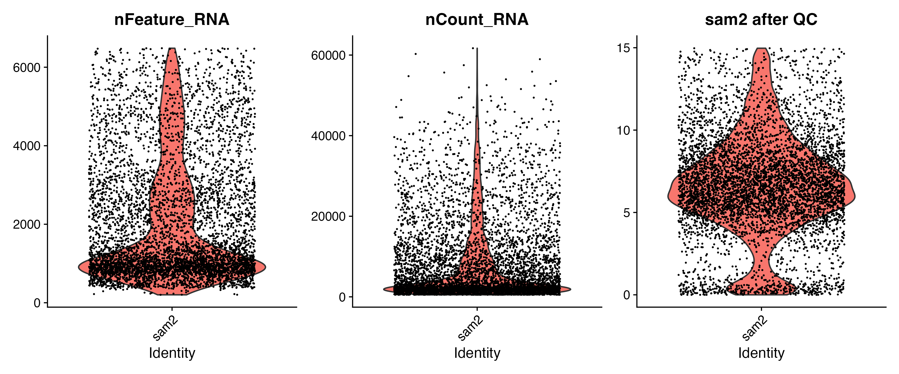

The violin plots provide a quick visual check of cell-level sequencing depth, feature complexity, and mitochondrial transcript percentage before and after filtering.

---

## Dimensionality Reduction and Integration

After normalization, variable feature selection, scaling, and PCA, UMAP embeddings were generated before and after integration. Three views were compared:

- **PCA UMAP before integration**
- **Harmony-integrated UMAP**
- **CCA-integrated UMAP**

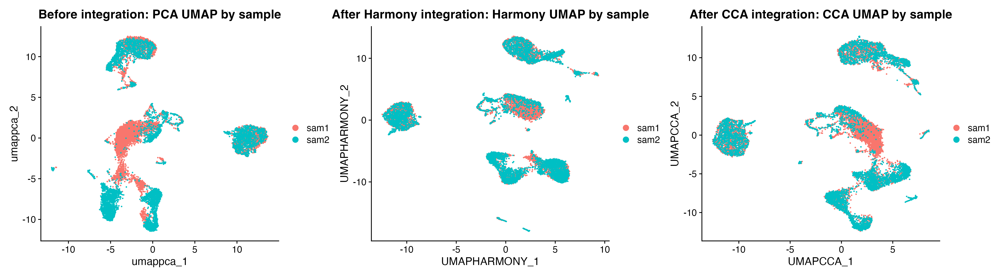

Before integration, cells showed visible sample-associated structure. Harmony and CCA were then used to compare integration strategies. The Harmony embedding was used for final clustering and downstream visualization in this workflow.

---

## Harmony-Based Clustering

Cells were clustered using Harmony embeddings and visualized on the Harmony UMAP.

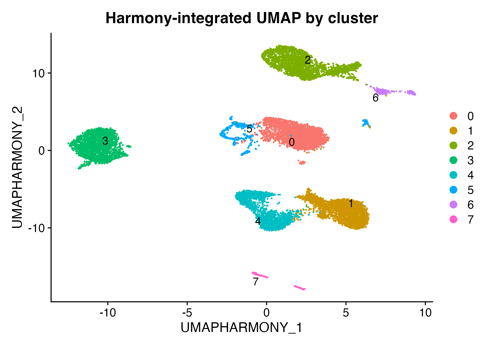

The same clusters were also visualized by sample to inspect how cells from both samples were distributed after integration.

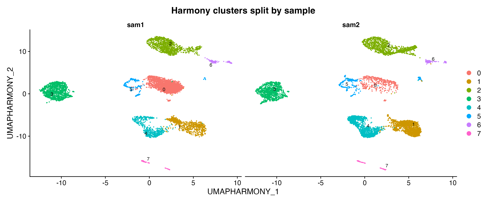

---

## Marker Gene Detection

Cluster marker genes were identified using Seurat differential expression testing. The workflow exports all cluster markers, upregulated markers, downregulated markers, and the top 10 upregulated marker genes per cluster.

Selected marker genes were visualized on the Harmony UMAP.

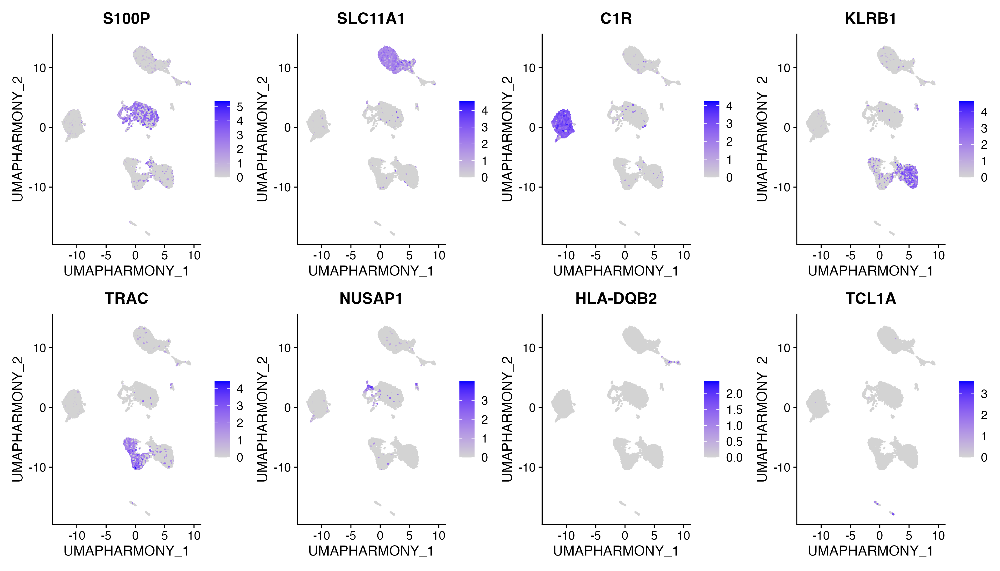

The selected marker genes highlight distinct cell populations in the integrated dataset. For example, immune-associated genes such as **TRAC** and **KLRB1** localize to T/NK-associated regions, while **SLC11A1** and **C1R** show stronger signal in myeloid or macrophage-associated regions. These marker visualizations help connect unsupervised clusters with interpretable biological cell populations.

The top upregulated marker genes per cluster were also visualized using a heatmap.

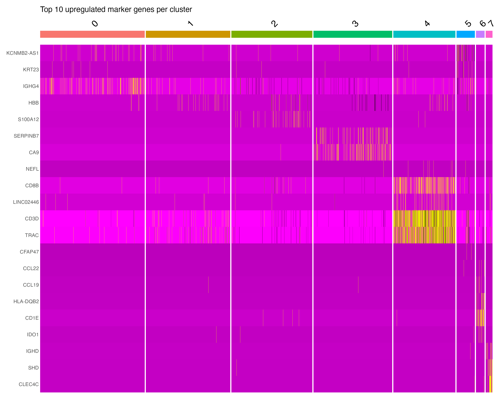

---

## Cell Type Annotation

Automated cell type annotation was performed using **SingleR** with the **Human Primary Cell Atlas** reference from `celldex`. Predicted labels were added to the Seurat object metadata and visualized on the Harmony UMAP.

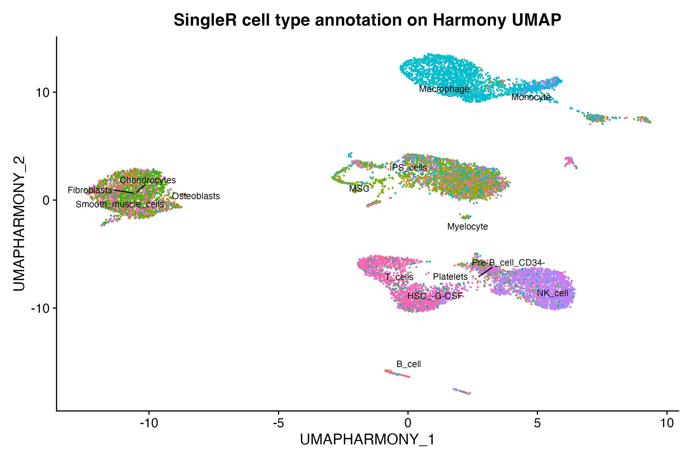

The SingleR annotation identified broad immune and stromal populations, including macrophage/monocyte-associated populations, T/NK-associated populations, B-cell-associated populations, and fibroblast or mesenchymal-associated populations. These labels provide a reference-based interpretation of the unsupervised clusters.

SingleR diagnostic plots were also saved to inspect annotation confidence.

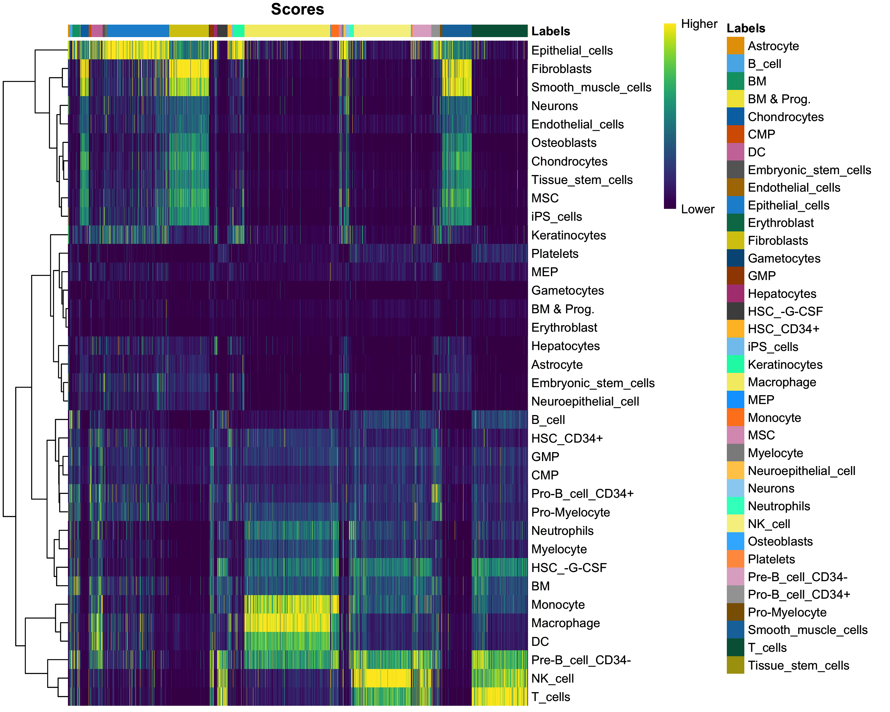

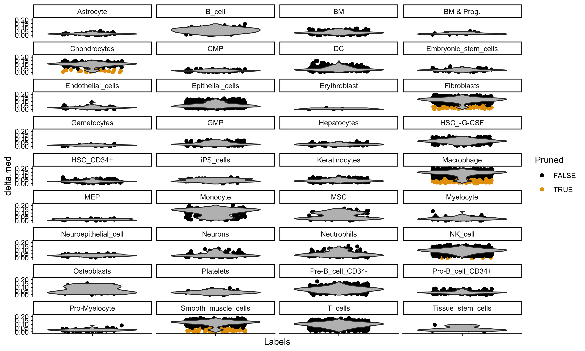

---

## Summary of Demonstrated Findings

This workflow demonstrates a complete Seurat-based analysis of two public metastatic breast cancer ascites scRNA-seq samples. Quality-control filtering removed low-quality cells based on detected gene counts and mitochondrial transcript percentage. UMAP visualization before integration showed sample-associated structure, while Harmony and CCA were used to compare integration strategies.

Harmony embeddings were used for final clustering. Cluster-specific marker genes were identified and exported for downstream interpretation. Selected marker genes showed population-specific expression patterns across the Harmony UMAP, and SingleR was used to assign broad reference-based cell type labels.

This project demonstrates practical skills in:

- 10x Genomics matrix loading
- Seurat object creation
- Per-sample quality control
- Cell filtering
- Dataset merging
- Normalization and variable feature selection
- PCA and UMAP visualization
- Harmony integration
- CCA integration comparison
- Graph-based clustering
- Marker gene detection
- Automated cell type annotation with SingleR
- Organized export of figures, tables, Seurat objects, and session information

---

## Notes and Limitations

This repository is intended as a workflow demonstration, not a full biological reproduction of the original study. The selected samples are used to demonstrate computational analysis steps, and conclusions should not be interpreted as validated clinical or biological findings.

The original publication investigates molecular biomarkers associated with late progression to CDK4/6 inhibition in HR+/HER2- metastatic breast cancer. This tutorial uses a small subset of public data from that study to demonstrate reproducible single-cell analysis methods.

SingleR annotations should be treated as broad reference-based labels. For a complete biological analysis, these predictions should be reviewed alongside canonical marker genes, study metadata, manual cluster annotation, and disease-specific biological context.

---

## Software

This workflow was developed in R using:

- Seurat
- Harmony
- SingleR
- celldex
- dplyr
- ggplot2
- patchwork

The full package versions used in the analysis are saved in:

```text
results/logs/sessionInfo.txt
```

---

## Author

**Harshitha Muddamsetty**  
Bioinformatics | Single-cell analysis | Reproducible workflows
